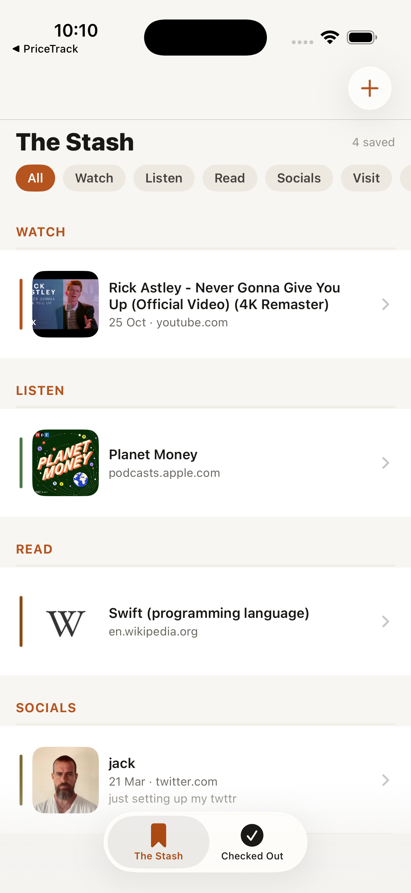
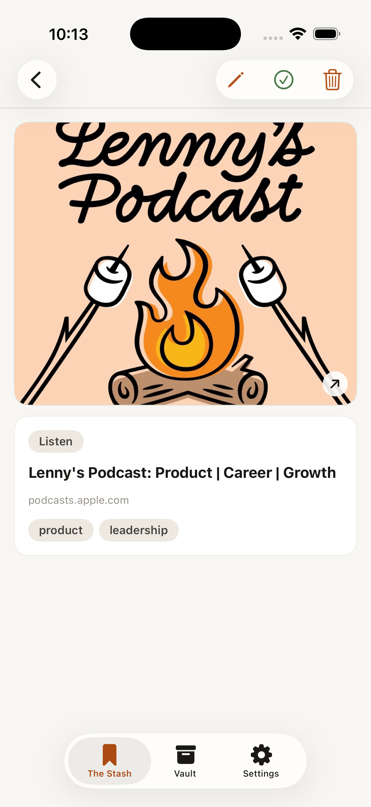
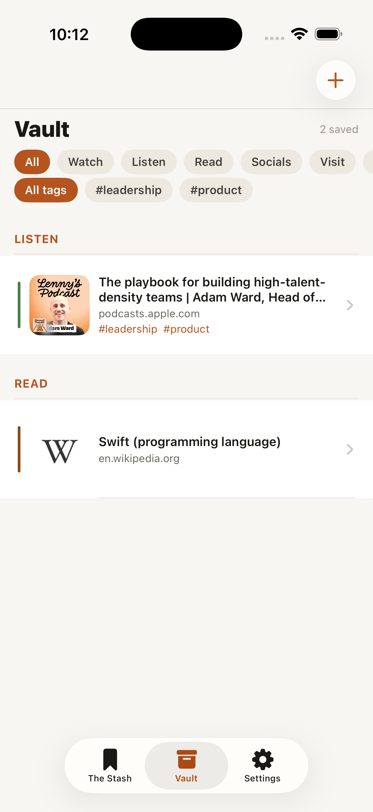
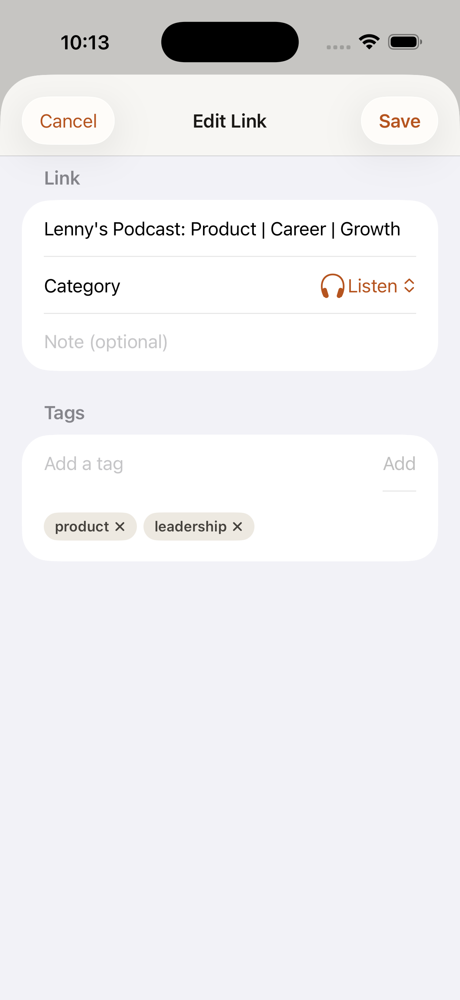
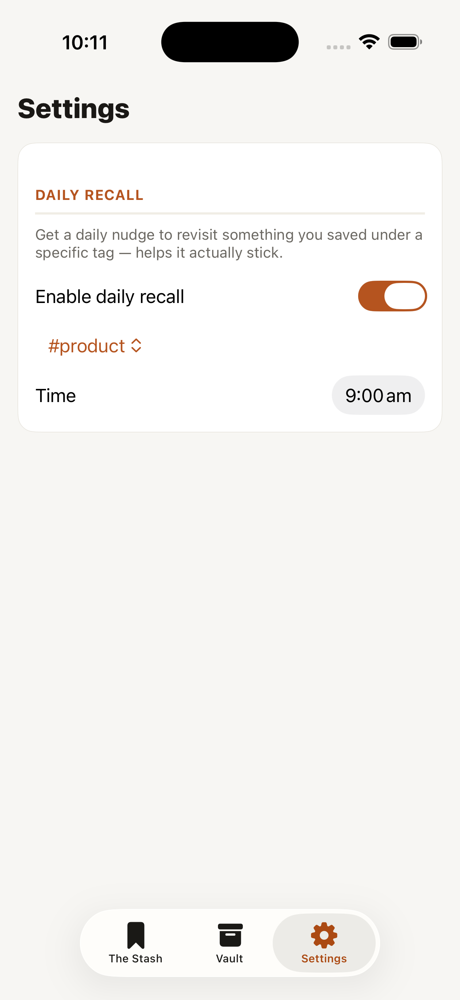

# Stash

Save any link — a podcast, a YouTube video, a Spotify audiobook, a restaurant, a LinkedIn or X post — with its title, image, and a preview of the content pulled in automatically, so you don't forget about it. Tag it, edit it, mark it done once you've actually checked it out, and let Stash nudge you to revisit it later. Add links from inside the app, or straight from the Share Sheet in Safari/YouTube/Instagram/etc.

  
  
  

  
  

*(Screenshots use public sample links — episodes of Lenny's Podcast and Planet Money — not real personal data.)*

## How it works

- **The Stash / Vault** tabs — your saved links, split by whether you've gotten to them yet. Marking a link done moves it to the Vault — a keep pile, not a delete pile. Filter by category (Watch / Listen / Read / Socials / Visit / Buy / Other) with the chip row up top; the header shows a live count of what's visible.
- **Add a link** (+ button, or the Share Sheet from any app) — Stash fetches a title and thumbnail automatically. YouTube and X/Twitter go through their own public oEmbed APIs for accurate titles and (for X) the actual post text; everything else uses Apple's LinkPresentation framework, the same engine behind Messages/Safari link previews. LinkedIn/Instagram/Facebook posts get their poster's name as the title and, best-effort, a caption preview. Category is guessed from the URL/domain and always editable. A publish date is picked up where the source exposes one (reliable for X; best-effort elsewhere via common meta tags).
- **Share Sheet**: tap *Share* from inside YouTube/Instagram/Safari/etc. and send straight to Stash — no need to copy/paste a URL. Handles both proper link shares and apps (like YouTube) that share plain text with a URL embedded in it.
- **Tap a link** to see the full preview — the image itself is the tap target to open the link (Safari/the relevant app) — plus any fetched post-preview text, your own note, tags, and category/done controls.
- **Edit anything** — tap the pencil icon on a link's detail view to fix up the title, category, note, or tags after the fact. Changes only apply on Save, so Cancel always discards them, no matter what you typed.
- **Tags** are free-form and cut across categories and source apps — tag a podcast episode and a saved article both "product" if that's how you think about them. Add tags from the Edit sheet (previously-used tags show up as one-tap suggestions); the list view gets a second filter row for them, alongside the existing category filter, so you can slice by category and tag together.
- **Daily recall**: from the Settings tab, turn on a once-a-day local notification tied to one tag and one time of day. The notification itself is a generic teaser ("Time to revisit your product stash") — no content is baked into it — and tapping it picks a genuinely random saved link under that tag at open time, so it's always fresh even if what's tagged has changed since the notification was scheduled.
